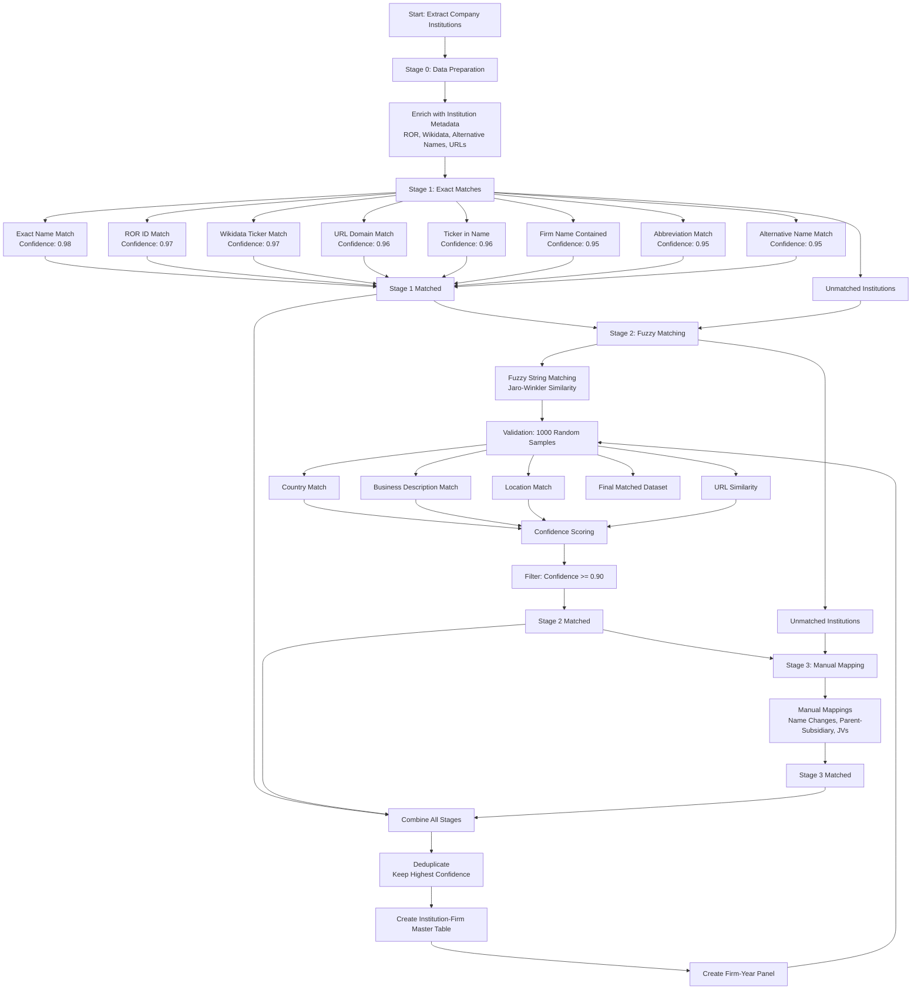

# OpenAlex Publication to CRSP/Compustat Matching Plan

## Overview

This plan implements a multi-stage matching methodology to link OpenAlex publication institutions (type=company) to CRSP/Compustat firms, following the successful patent matching approach while leveraging rich institution metadata available in OpenAlex (ROR, Wikidata, alternative names, URLs, acronyms). The goal is to achieve >95% accuracy with maximum coverage, similar to the patent matching results.

## Matching Flow Diagram



## Data Sources

- **Primary dataset**: `data/processed/publication/ai_papers_firm_affiliated.parquet` - Contains 797,032 papers with firm affiliations. We need to extract unique company institutions from `author_affiliation_ids` where the institution type is "company"
- **Institutions dataset**: `data/raw/publication/institutions_all.jsonl.gz` - Contains 27,126 company institutions with rich metadata:
  - ROR IDs (Research Organization Registry)
  - Wikidata IDs
  - Alternative names (`display_name_alternatives`)
  - Acronyms (`display_name_acronyms`)
  - Homepage URLs
  - Country codes
  - Geographic information
- **Financial data**: `data/raw/compustat/crsp_a_ccm.csv` - CRSP/Compustat firm data (already standardized in `data/interim/compustat_firms_standardized.parquet`)

## Key Statistics

- **Total company institutions in OpenAlex**: 27,126
- **Company institutions appearing in papers**: ~16,278 (based on preliminary scan)
- **Unique affiliation IDs in papers**: 48,292
- **Target**: Match as many company institutions as possible to CRSP firms with >95% accuracy

## Methodology

Following the patent matching approach (Arora et al. 2021, Kogan et al. 2017), we implement a three-stage matching process:

### Stage 0: Data Preparation and Enrichment

**Script**: `src/02_linking/prepare_publication_institutions.py`

1. **Extract company institutions from papers**:

   - Load `ai_papers_firm_affiliated.parquet`
   - Extract unique `author_affiliation_ids` where type="company"
   - Count papers per institution
   - Create institution-paper mapping

2. **Enrich institutions with metadata**:

   - Load `institutions_all.jsonl.gz` and filter to company type
   - Match institutions from papers to full institution records
   - Extract and standardize:
     - Display name and alternative names
     - ROR IDs
     - Wikidata IDs
     - Acronyms
     - Homepage URLs
     - Country codes
   - Create normalized name variants for each institution

3. **Output**: `data/interim/publication_institutions_master.parquet`

   - Columns: `institution_id`, `display_name`, `normalized_name`, `alternative_names` (list), `acronyms` (list), `ror_id`, `wikidata_id`, `homepage_url`, `country_code`, `paper_count`, `name_variants` (list)

### Stage 1: Exact and High-Confidence Matches

**Script**: `src/02_linking/match_publications_to_firms_stage1.py`

Following patent matching Stage 1, implement exact matching strategies:

1. **Exact name match** (confidence: 0.98):

   - Match standardized institution name to standardized firm name (`conm_clean` or `conml_clean`)
   - Use same name cleaning function as patent matching

2. **ROR to firm matching** (confidence: 0.97):

   - Query ROR API or use ROR-to-CRSP mapping if available
   - Match ROR IDs to firm identifiers
   - Validate with name similarity check

3. **Wikidata ticker matching** (confidence: 0.97):

   - Extract ticker symbols from Wikidata for matched institutions
   - Match to CRSP ticker symbols (`tic`)
   - Cross-validate with name similarity

4. **URL domain matching** (confidence: 0.96):

   - Extract domain from institution `homepage_url`
   - Match to firm `weburl` domain
   - Normalize domains (remove www, http/https, trailing slashes)
   - Cross-validate with name similarity

5. **Ticker in institution name** (confidence: 0.96):

   - Check if firm ticker appears in institution name (e.g., "IBM Research")
   - Match to corresponding firm

6. **Firm name contained in institution** (confidence: 0.95):

   - Check if standardized firm name appears as substring in institution name
   - Useful for subsidiaries (e.g., "Google AI" contains "Google")

7. **Abbreviation match** (confidence: 0.95):

   - Match institution acronyms to firm abbreviations
   - Use abbreviation dictionary from patent matching

8. **Alternative name matching** (confidence: 0.95):

   - Check if any `display_name_alternatives` match firm names
   - Apply same standardization

**Output**: `data/processed/linking/publication_firm_matches_stage1.parquet`

- Columns: `institution_id`, `GVKEY`, `match_method`, `match_confidence`, `match_type`="stage1"

### Stage 2: Fuzzy String Matching with Cross-Validation

**Script**: `src/02_linking/match_publications_to_firms_stage2.py`

For institutions not matched in Stage 1:

1. **Fuzzy string matching**:

   - Use Jaro-Winkler similarity (same as patent matching)
   - Minimum similarity threshold: 0.85
   - Consider all name variants (display name, alternatives, acronyms)

2. **Cross-validation checks**:

   - **Country validation**: Institution country must match firm country (`fic`)
   - **Business description validation**: Keywords from institution name should appear in firm `busdesc`
   - **Location validation**: Geographic proximity check (city/state if available)
   - **URL similarity**: If both have URLs, check domain similarity

3. **Confidence scoring**:

   - Base confidence from fuzzy similarity (0.85-0.99 maps to 0.90-0.99)
   - Boost confidence by +0.02 for each validation check passed:
     - Country match: +0.02
     - Business description match: +0.02
     - Location match: +0.01
     - URL similarity: +0.01
   - Maximum confidence: 0.99

4. **Filtering**:

   - Only accept matches with confidence ≥ 0.90
   - For confidence 0.90-0.95, require at least 2 validation checks
   - For confidence ≥ 0.95, require at least 1 validation check

**Output**: `data/processed/linking/publication_firm_matches_stage2.parquet`

- Columns: `institution_id`, `GVKEY`, `match_method`, `match_confidence`, `match_type`="stage2", `validation_flags` (list)

### Stage 3: Manual Mapping and Edge Cases

**Script**: `src/02_linking/match_publications_to_firms_stage3.py`

Handle known edge cases:

1. **Name changes**: Map historical names to current firm names

   - Example: Facebook → Meta
   - Example: Google → Alphabet (parent company)

2. **Parent-subsidiary relationships**:

   - Map subsidiary institutions to parent firms
   - Example: "Google AI" → Alphabet Inc.

3. **Joint ventures**: Map joint venture institutions to participating firms

4. **Large firm manual mappings**:

   - Create manual mapping file for top 100 firms by paper count
   - Review and validate manually

**Output**: `data/processed/linking/publication_firm_matches_stage3.parquet`

- Columns: `institution_id`, `GVKEY`, `match_method`, `match_confidence`=0.99, `match_type`="stage3"

### Stage 4: Combine and Deduplicate

**Script**: `src/02_linking/combine_publication_matches.py`

1. **Combine all stages**:

   - Load Stage 1, 2, and 3 matches
   - Union all matches

2. **Deduplicate**:

   - For each institution-firm pair, keep highest confidence match
   - If same confidence, prefer earlier stage (Stage 1 > Stage 2 > Stage 3)

3. **Quality checks**:

   - Flag institutions matched to multiple firms (may need review)
   - Flag firms matched to multiple institutions (subsidiaries OK)

4. **Output**: `data/processed/linking/publication_firm_matches_final.parquet`

   - Columns: `institution_id`, `GVKEY`, `match_method`, `match_confidence`, `match_type`, `is_primary_match` (bool)

### Stage 5: Create Institution-Firm Master Table

**Script**: `src/02_linking/create_publication_institution_firm_master.py`

1. **Enrich matches with institution metadata**:

   - Join with institution master table
   - Add firm information from Compustat

2. **Calculate statistics**:

   - Papers per institution-firm pair
   - Total papers per firm
   - Institution coverage

3. **Output**: `data/interim/publication_institution_firm_master.parquet`

   - Columns: All institution fields, all firm fields, match metadata, paper counts

### Stage 6: Create Firm-Year Panel

**Script**: `src/03_analysis/create_publication_firm_year_panel.py`

1. **Aggregate papers to firm-year level**:

   - Load `ai_papers_firm_affiliated.parquet`
   - Join with institution-firm matches
   - Group by `GVKEY` and `publication_year`
   - Count papers per firm-year
   - Calculate citation metrics per firm-year

2. **Output**: `data/processed/analysis/firm_year_panel_with_publications.parquet`

   - Columns: `GVKEY`, `year`, `total_papers`, `total_citations`, `mean_citations_per_paper`, `papers_by_topic` (if needed)

### Stage 7: Validation

**Script**: `src/02_linking/validate_publication_matches.py`

1. **Create validation sample**:

   - Randomly sample 1,000 matches stratified by stage and confidence
   - Enrich with institution and firm context
   - Export to CSV for manual validation

2. **Calculate accuracy**:

   - After manual validation, calculate accuracy by stage
   - Compare to patent matching accuracy (95.4% overall)

3. **Output**: 

   - `data/processed/linking/publication_validation_sample_1000.csv`
   - `data/processed/linking/publication_validation_accuracy_report.json`

## Implementation Details

### Name Standardization

Reuse the `clean_organization_name()` function from `standardize_compustat_for_patents.py`:

```python
def clean_organization_name(name: str | None) -> str | None:
    if name is None or name == "":
        return None
    name = name.upper()
    suffixes_pattern = r'\b(INCORPORATED|CORPORATION|COMPANY|LIMITED|L\.?L\.?C\.?|INC\.?|LTD\.?|CORP\.?|CO\.?|PLC\.?|S\.?A\.?|A\.?G\.?|GMBH|N\.?V\.?|B\.?V\.?)\b'
    name = re.sub(suffixes_pattern, '', name)
    name = re.sub(r'[^\w\s]', '', name)
    name = re.sub(r'\s+', ' ', name).strip()
    return name if name else None
```

### ROR and Wikidata Integration

- **ROR API**: Query ROR API for institution metadata if ROR ID available
- **Wikidata**: Use Wikidata API or pre-extracted ticker mappings
- **Fallback**: If API calls fail, use data from `institutions_all.jsonl.gz`

### Performance Optimization

- Use lookup dictionaries for fast matching (similar to patent matching)
- Process institutions in batches
- Cache API responses for ROR/Wikidata queries
- Use Polars for efficient data processing

## Expected Outcomes

- **Coverage**: Match 60-80% of company institutions to CRSP firms (similar to patent coverage of 70%)
- **Accuracy**: >95% overall accuracy (validated on 1,000 random samples)
- **Stage 1 accuracy**: 100% (exact matches)
- **Stage 2 accuracy**: 85-95% (fuzzy matches with validation)
- **Final panel**: Firm-year panel with paper counts and citation metrics

## Comparison with Patent Matching

| Aspect | Patent Matching | Publication Matching |

|--------|----------------|---------------------|

| Data source | USPTO PatentsView | OpenAlex |

| Total entities | 97,507 assignees | ~16,278 company institutions |

| Matched entities | 31,318 (32.1%) | Target: 10,000-13,000 (60-80%) |

| Patents/Papers matched | 902,392 (70.0%) | Target: Similar coverage |

| Overall accuracy | 95.4% | Target: >95% |

| Stage 1 accuracy | 100.0% | Target: 100.0% |

| Stage 2 accuracy | 57.0% (96.7% for high conf) | Target: 85-95% |

## Files to Create

1. `src/02_linking/prepare_publication_institutions.py` - Stage 0: Data preparation
2. `src/02_linking/match_publications_to_firms_stage1.py` - Stage 1: Exact matches
3. `src/02_linking/match_publications_to_firms_stage2.py` - Stage 2: Fuzzy matching
4. `src/02_linking/match_publications_to_firms_stage3.py` - Stage 3: Manual mappings
5. `src/02_linking/combine_publication_matches.py` - Combine all stages
6. `src/02_linking/create_publication_institution_firm_master.py` - Create master table
7. `src/03_analysis/create_publication_firm_year_panel.py` - Create firm-year panel
8. `src/02_linking/validate_publication_matches.py` - Validation

## Dependencies

- Polars (data processing)
- RapidFuzz (fuzzy string matching)
- Requests (ROR/Wikidata API calls, optional)
- Standard library: re, json, gzip, pathlib

## Literature References

- Arora et al. (2021): Extended NBER patent-Compustat matching methodology
- Kogan et al. (2017): Original NBER patent-Compustat matching
- Dyevre & Seager (2023): Comprehensive patent-firm matching (9,708 firms, 3.4M patents)